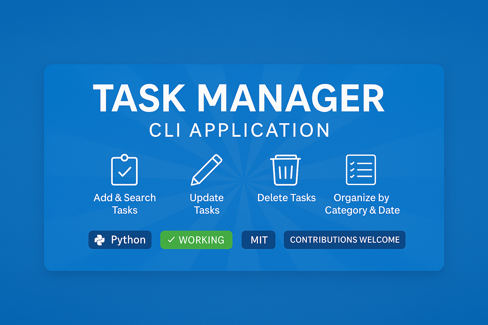

# 📝 Task Manager CLI Application


> A simple yet powerful terminal-based Task Manager written in Python. Organize, search, update, and delete your daily tasks efficiently using categories, deadlines, and priorities.

---

## 📂 Folder Structure

```

📁 Task-Manager/
├── 📁 tests/                 # Unit test folder
│   └── test_sample.py       # Sample test file
├── 📄 task_manager.py       # Main Python logic
├── 📄 data.txt              # Stores actual tasks (ignored in Git)
├── 📄 sample_data.txt       # Public demo tasks
├── 📄 banner.txt            # Optional banner (ASCII)
├── 📄 README.md             # You're here!
├── 📄 LICENSE               # MIT License
├── 📄 .gitignore            # Files to ignore in Git

```

---

## ✅ Features

- 📌 **Add Task** with title, description, deadline, priority, and category
- 🔍 **Search Tasks** by title, category, or deadline
- 🔁 **Update** existing tasks by title
- ❌ **Delete** tasks by title
- 📃 **List All Titles** of saved tasks
- 🗃️ **Print All Tasks** in a clean, readable format
- 💾 **Uses plain text file** for storage — no database required

---

## 🧾 Sample Output (Terminal)

```bash
====Welcome to task manager====
Enter title: Buy Groceries
Enter description: Milk, Bread, Eggs
Enter deadline date(YYYY-MM-DD): 2025-07-10
Enter priority(High/Medium/Low): High
Enter category: Personal
Task added successfully!

Enter what you want to do
1.add_task
2.search_by_title
3.search_by_category
4.search_by_deadlinedate
5.delete_task_by_title
6.update_task_by_title
7.list_all_titles
8.print_all_tasks
````

---

## 🛠️ How to Run

### ▶️ Prerequisites

- Python 3.10 or higher installed on your machine

### ▶️ Run App

```bash
python task_manager.py
```

---

## 📁 Sample Task Entry Format

```
==========================
Title:Buy Groceries
Description:Milk, Bread, Eggs
Deadline:2025-07-10
Priority:High
Category:Personal
==========================
```

---

## 🧪 Tests

A sample test file is placed inside the `/tests` folder.

> To run tests (in future):

```bash
pytest tests/
```

---

## 🔒 License

This project is licensed under the **MIT License**.
See the full license text here: [LICENSE](./LICENSE)

---

## 🚀 Future Improvements

* [ ] Add automatic due-date reminders
* [ ] Add colored output for High/Medium/Low priority
* [ ] Add GUI version (Tkinter or PyQT)
* [ ] Add export to JSON / CSV format
* [ ] Add proper test coverage and unit tests

---

## 🤝 Contributing

Pull requests are welcome!
For any major changes, please open an issue first to discuss your ideas.

---

## ❤️ Made with Passion by [Rumaisa Islam](https://github.com/Rumaisas-islam)

```
